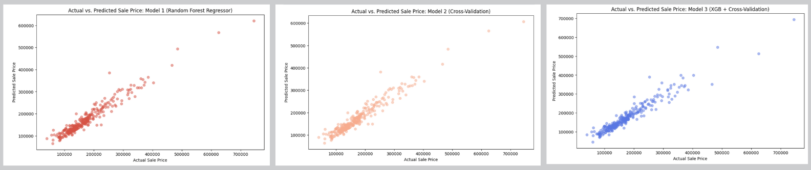

# House Price Predictor

    

This repository has my code for my [competition submission](https://www.kaggle.com/code/johannaschmidle7/house-price-predictor) for the [Housing Prices Competition for Kaggle Learn Users](https://www.kaggle.com/competitions/home-data-for-ml-course)

## Motivation
**Goal:** build a machine learning model to predict the sales price for each house. For each Id in the test set, I must predict the value of the **SalePrice** variable. 

## Metric
Submissions are evaluated on **Root-Mean-Squared-Error** (RMSE) between the logarithm of the predicted value and the logarithm of the observed sales price. (Taking logs means that errors in predicting expensive houses and cheap houses will affect the result equally.)

## Steps 
1. **Select Features**
   - There are a lot of features to choose from (80). I am going to focus on the ones that I think will have the most significant impact on housing price. I focused on features related to:
       -  Quality and Condition
       -  Size and Space
       -  Year Built and Remodel Date
       -  Location
       -  Amenities
2. **Visualize and Understand Data**
   - Histograms
   - Correlation Heatmap
3. **Preprocessing**
   - Dealing with skewed data
   - Null Values
   - Split the Data (Into train_X, val_X, train_y, val_y,)
   - Dealing with Categorical Features
     - Ordinal Encoding
     - OneHot Encoding
     - Deciding if a feature was worth keeping. This included:
       - ANOVA (Analysis of Variance) Testing
       - Boxplot
       - Bar chart
     - Target Encoding
4. **Define Model**
   - I create 3 models total
     - Model 1: Random Forest Regressor
     - Model 2: Random Forest Regressor + parameters from Cross-Validation
     - Model 3: XGBoost + parameters from Cross-Validation
  - I create model 2 and 3 in steps 6 and 7 (respectively). In this step I only create model 1. 
5. **Evaluate Model**
   - Mean Absolute Error (MAE)
   - Mean Squared Error (MSE)
   - Root Mean Squared Error (RMSE)
   - R² Score (R-Squared) (coefficient of determination)
   - Created a visualization to see model (at top of ReadMe)
6. **Cross-Validation**
   - Performed grid search for hyperparameter tuning
   - Evaluated the best parameters and model performance using the same metrics as step 5
   - Created a visualization to see model (at top of ReadMe)
7. **XGBoost** (with Cross-Validation)
   - Performed grid search for hyperparameter tuning
   - Evaluated the best parameters and model performance using the same metrics as step 5
   - Created a visualization to see model (at top of ReadMe)

## Result of Model Evaluations
The range in SalePrice is between $34,900 and $755,000
### Model 1: Random Forest Regressor
- Mean Absolute Error (MAE): On average, the model’s predictions are off by **$15,166** from the actual values 
- Mean Squared Error (MSE): 505,306,699.1469689
- Root Mean Squared Error (RMSE): On average, the model’s predictions are off by approximately **$22,479.03**
- R² Score (R-Squared): Approximately **92.9%** of the variance in the target variable can be explained by the model
- View the **Red** graph at top of ReadMe to see a visualization of this model
### Model 2: Random Forest Regressor + Cross-Validation
- Mean Absolute Error (MAE): On average, the model’s predictions are off by **$15,376** from the actual values
- Mean Squared Error (MSE): 527,937,019.0061122
- Root Mean Squared Error (RMSE): On average, the model’s predictions are off by approximately **$22,976.88**
- R² Score (R-Squared): Approximately **92.6%** of the variance in the target variable can be explained by the model.
- View the **Orange** graph at top of ReadMe to see a visualization of this model
### Model 3: XGBoost + Cross-Validation
- Mean Absolute Error (MAE): On average, the model’s predictions are off by **$14,872** from the actual values 
- Mean Squared Error (MSE): 527,363,271.027355
- Root Mean Squared Error (RMSE): On average, the model’s predictions are off by approximately **$22,964.39**
- R² Score (R-Squared): Approximately **92.6%** of the variance in the target variable can be explained by the model.
- View the **Blue** graph at top of ReadMe to see a visualization of this model
  
## Data
The dataset used in this project is available publicly on Kaggle: [https://www.kaggle.com/competitions/home-data-for-ml-course](https://www.kaggle.com/competitions/home-data-for-ml-course)

## Features Used
- **OverallQual**: Overall material and finish quality.
- **OverallCond**: Overall condition rating.
- **YearBuilt**: Original construction year.
- **YearRemodAdd**: Remodel year.
- **GrLivArea**: Above grade (ground) living area square feet.
- **TotalBsmtSF**: Total square feet of basement area.
- **1stFlrSF**: First-floor square feet.
- **2ndFlrSF**: Second-floor square feet.
- **GarageCars**: Size of garage in car capacity.
- **GarageArea**: Size of garage in square feet.
- **FullBath**: Full bathrooms above grade.
- **HalfBath**: Half bathrooms above grade.
- **KitchenQual**: Kitchen quality.
- **TotRmsAbvGrd**: Total rooms above grade (does not include bathrooms).
- **Fireplaces**: Number of fireplaces.
- **FireplaceQu**: Fireplace quality.
- **GarageYrBlt**: Year garage was built.
- **LotArea**: Lot size in square feet.
- **Neighborhood**: Physical locations within Ames city limits.
- **BsmtFinSF1**: Type 1 finished square feet in the basement.
- **BsmtFinSF2**: Type 2 finished square feet in the basement.
- **BsmtUnfSF**: Unfinished square feet in the basement.
- **HeatingQC**: Heating quality and condition.
- **CentralAir**: Central air conditioning (Y=Yes, N=No).
- **BedroomAbvGr**: Number of bedrooms above grade.

## Technologies
- Python
    - pandas, numpy, matplotlib, seaborn
    - sklearn (RandomForestRegressor, mean_absolute_error, train_test_split, OrdinalEncoder, OneHotEncoder, DecisionTreeRegressor, mean_squared_error, r2_score, cross_val_score, GridSearchCV)
    - scipy
    - category_encoders
    - xgboost
    - IPython.display (display, HTML)
